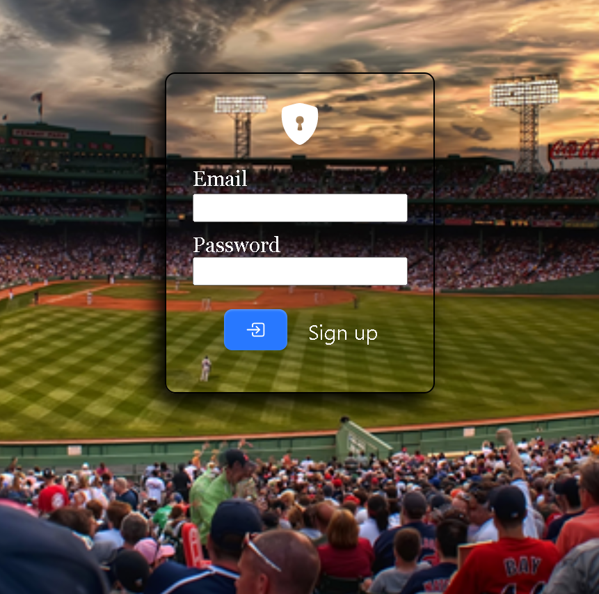
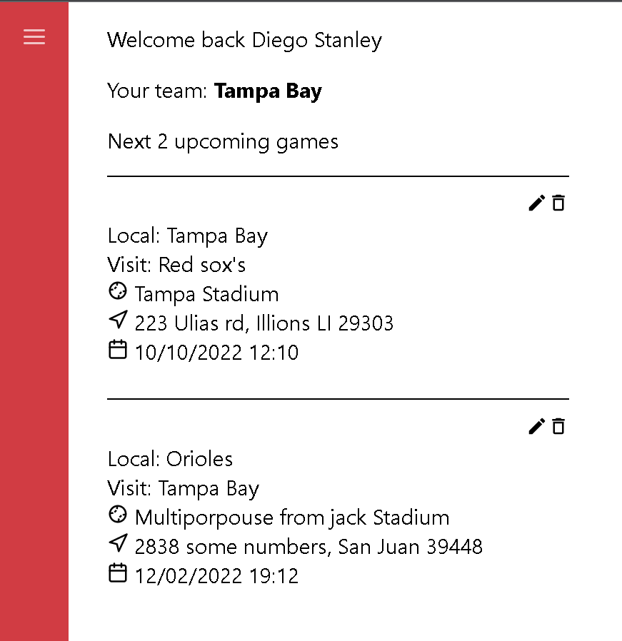

# Baseball game management website
This website is created to _Create_, _Read_, _Update_ and _Delete_ baseball Games.




## Installation
Clone the project and run npm install
```
git clone https://github.com/diegoFMR/baseball.git
cd baseball-website
npm install
```

## Run 
```
npm start
```

## Dependencies
- react-sidenav 0.5.0
- react 18.2.0
- rmik 2.2.9
- react-datepicker 4.8.0
- react-icons 4.4.0
- react-modal
- react-router-dom 6.3.0
- yup 0.32.11

## CREDENTIALS
For testing porpuses!

User: d@d.com 
Password: password